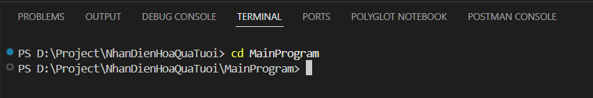
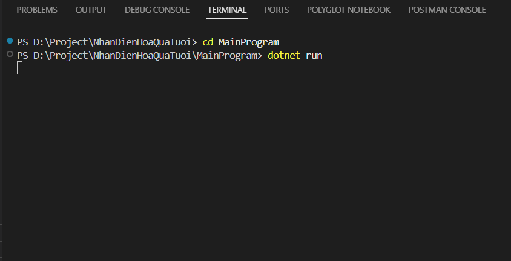
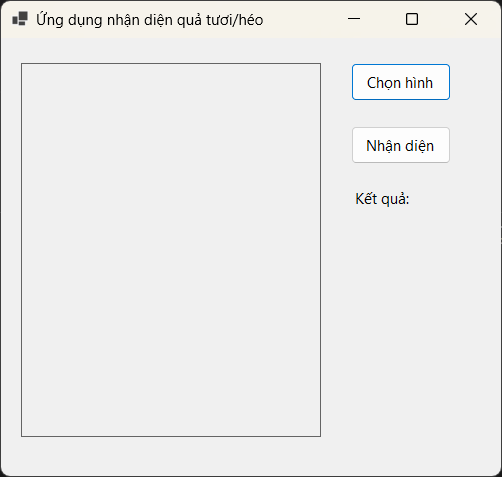
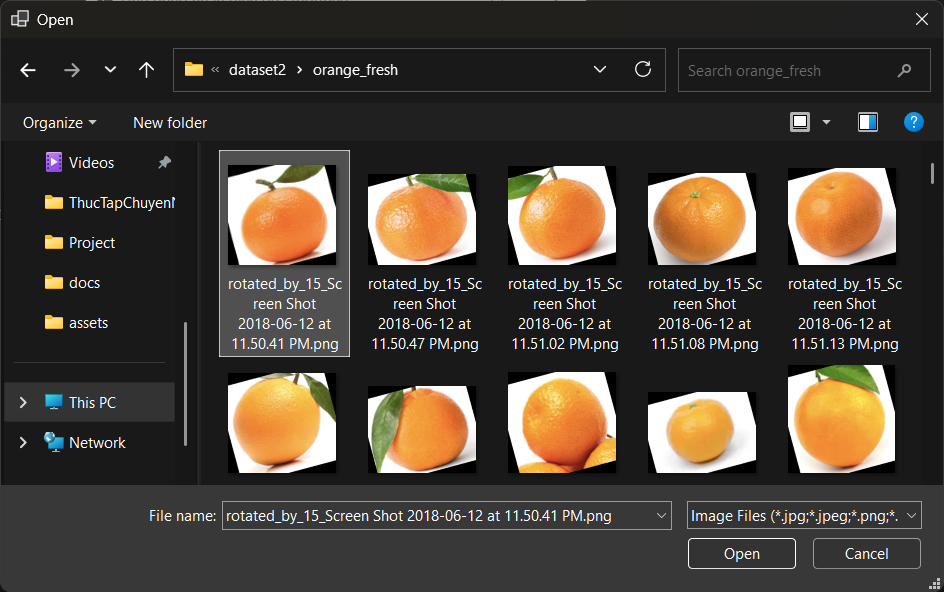
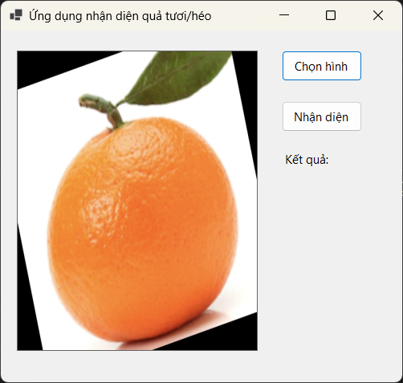
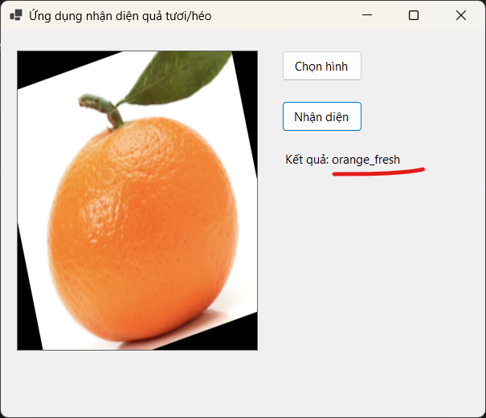
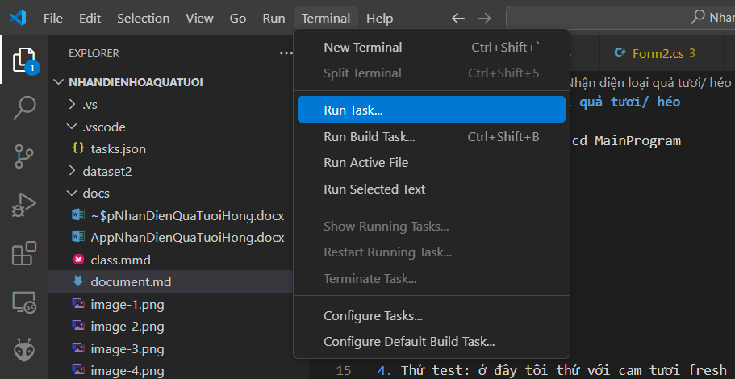
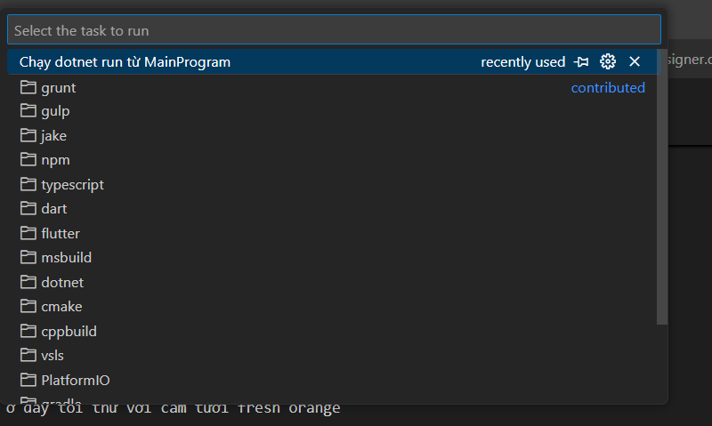

# project: Nhận diện loại quả tươi/ héo
## Hướng dẫn chạy app
1. Mở new terminal nhập: cd MainProgram

2. Tiếp nhập dotnet run

3. Đợi app khởi động: 

4. Thử test: ở đây tôi thử với cam tươi fresh orange 

5. Thấy load ảnh vừa chọn lên giao diện rồi thì nhấn nhận diện

6. Kết quả nhận diện

## Cách chạy app nhanh
- Chọn Terminal > Run Task

- Chọn task đã cài sẵn: chạy main program. ĐƠi app khởi động

